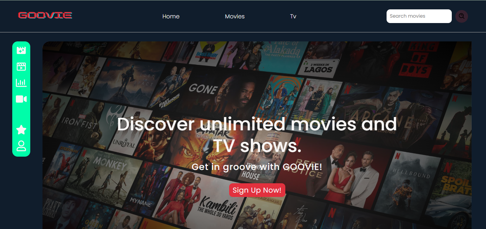

# GOOVIE 🎬🍿

## Description

Goovie is a web app for discovering unlimited movies and TV shows.



Inspired by the Netflix web app.


### Frontend Dependencies
* The frontend of this project is built with **React js** and some third party packages like **react router**.

## Main Files: Project Structure

  ```sh
  ├── README.md
  ├── package.json
  ├── public
  │   ├── index.html
  └── src
      ├── components
      ├── containers
      ├── pages
      ├── assets
      ├── store
      ├── sass
      │   ├── App.js
      │   ├── index.js
      └──  index.scss
  ```

## Getting Started

### Prerequisites & Installation
To be able to get this application up and running, ensure to have [node](https://nodejs.org/en/download/) installed on your device.

### Development Setup (frontend)
1. **This project uses NPM to manage software dependencies. NPM Relies on the package.json file located in the `root` directory of this repository. After cloning, open your terminal and run:**
``` bash
npm install
```
2. **Starting the app in devlopment mode** from the root folder run:
``` bash
npm start
```
3. **At this point, the frontend should be up and running** at [http://127.0.0.1:3000/](http://127.0.0.1:3000/) or [http://localhost:3000](http://localhost:3000)

## Deployment N/A
App is still in production.

## Authors
[Sonde Omobolaji](https://github.com/omobolajisonde)